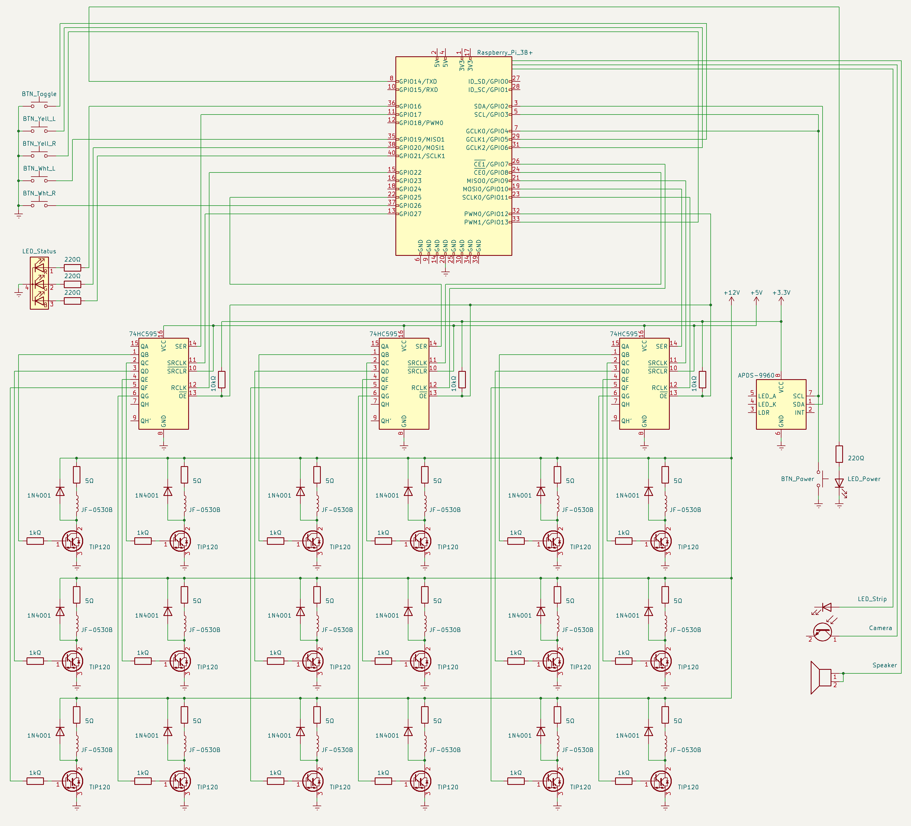

# `optophone`

<!-- Source code for my undergraduate design project -->

Software for a reading machine powered by Raspberry Pi 3B+

> Unfortunately did not get a `requirements.txt`, OS version, and Python version before the project was submitted...

## Circuit



### I2C and power button

> - https://elinux.org/RPI_safe_mode
> - https://forums.raspberrypi.com/viewtopic.php?f=29&t=24682
> - https://forums.raspberrypi.com/viewtopic.php?f=29&t=12007

- Pi can be woken (turned on) by shorting pins 5 and 6
  - Pin 5 is `GPIO3`
  - Pin 6 is `GND`
- Power button is grounded on one leg, and both `GPIO3` and `GPIO4` on the other
- Power off is handled on `GPIO4` via software
  - Ends program and executes `sudo poweroff`
- On normal operations, power button causes I2C issues as `GPIO3` is also `I2C1 SCL`
  - Deemed to matter little as the device will be powered off anyway
  - Naive safeguard implemented where I2C devices are reinitialized after issues

### Register enables

- All connected to `GPIO12`
- Default off by pulling up to 3.3V
  - Ideally should be 5V
  - However, line is connected with Pi GPIO, which are [**not 5V-tolerant**](https://forums.raspberrypi.com/viewtopic.php?t=227262)
  - [3.3V can still assert 5V TTL](https://learn.sparkfun.com/tutorials/logic-levels/all#33-v-cmos-logic-levels)

## Review of GPIO libraries

> https://raspberrypi.stackexchange.com/questions/58820/compare-and-contrast-python-gpio-apis

### `gpiozero`

- Has simplest API, most modern, and has underlying support for other major libraries
- Endorsed by Raspberry Pi Foundation itself
- (?) Created by members of the foundation
  - Who also created https://piwheels.org/
- https://www.raspberrypi.com/news/gpio-zero-a-friendly-python-api-for-physical-computing/
- https://www.raspberrypi.com/documentation/computers/os.html#gpio-in-python

### `pigpio`

- Most detailed, most accurate (hardware-timed)
- Endorsed by `gpiozero` docs

### `wiringPi`

- Closest to Arduino
- Also rather complex
- [Author unfortunately closed the project](https://web.archive.org/web/20220405225008/http://wiringpi.com/wiringpi-deprecated/)

### `RPi.GPIO`

- Was the de-facto standard for a _long_ time

### `RPIO`

- Extension of `RPi.GPIO`

## Test GPIO health / status

https://abyz.me.uk/rpi/pigpio/faq.html#Have_I_fried_my_GPIO

```sh
gpiotest
```

- Needs `sudo pigpiod` (`pigpio` daemon)
- This is run automatically via `~/.profile`
  - File contains caveats for when it is executed

## Running the project

### As a module

- Implicitly uses top-level `__main__.py`
- `PYTHONPATH` is a Python-exclusive extension of `PATH`
- Add project directory parent to `PYTHONPATH` so that it is visible
- Project directory cannot be given directly to `python`

```sh
PYTHONPATH=$(cd .. && pwd) python -m optophone
```

### With `-B` flag to avoid `__pycache__`

- https://github.com/pytest-dev/pytest/issues/200
- https://docs.python.org/3/using/cmdline.html#cmdoption-B

```sh
PYTHONPATH=$(cd .. && pwd) python -B -m optophone
```

### With `pigpio` factory for `gpiozero`

- https://gpiozero.readthedocs.io/en/stable/api_pins.html#changing-pin-factory

```sh
GPIOZERO_PIN_FACTORY=pigpio PYTHONPATH=$(cd .. && pwd) python -B -m optophone
```

### With modified `loguru` default format

- Slightly modifies default format as per docs
- https://github.com/Delgan/loguru/blob/master/loguru/_defaults.py#L31
- Aligns names

```sh
LOGURU_FORMAT="<green>{time:YYYY-MM-DD HH:mm:ss.SSS}</green> │ <level>{level: <8}</level> │ <cyan>{name: <32.32}</cyan> : <cyan>{function: <16.16}</cyan> : <cyan>{line: >3}</cyan> - <level>{message}</level>" \
GPIOZERO_PIN_FACTORY=pigpio \
PYTHONPATH=$(cd .. && pwd) \
python -B -m optophone
```

### With a shell script

- Wrapper for above verbose one-line command
- Receives **module name** as argument

Running this...

```sh
./run.sh optophone
```

...is equivalent to this.

```sh
...  # Temporary environment variables
python -B -m optophone
```

## Testing

> ⚠ A very naive testing methodology was used, to keep things simple

### Unit tests

- Each source file represents a component or set of related functions
- Because of the modular approach, each source file can be run on its own, e.g.
  ```sh
  # Will run the `utilities/usb.py` file
  ./run.sh optophone.utilities.usb
  ```
- When applicable, each source file will have a `if __name__ == "main":` block at the end that uses its declared functions for basic testing when run on its own

### Integration tests

- Independent entrypoint files are defined under the `tests/` directory
- These files import other components or utilities
- These are run with e.g.
  ```sh
  # Will run the `tests/tts_player.py` file
  ./run.sh optophone.tests.tts_player
  ```
- In running these files, the functionalities of the imported components and utilities are enabled so their behavior may be observed

## Concepts

- Decorators
- Async
- Pubsub
- Main blocks
- Modules | Scripts | ~~Packages~~
- Files as singletons

## `uhubctl` USB permissions

- https://github.com/mvp/uhubctl#linux-usb-permissions
- https://github.com/mvp/uhubctl/tree/d98e6deb6ed752811fd959414366ec889ac8aeec#linux-usb-permissions
  - Outdated version installed (`v2.3.0-1`)

### File for rules

`/etc/udev/rules.d/52-usb.rules`

```sh
sudo nano /etc/udev/rules.d/52-usb.rules
cat /etc/udev/rules.d/52-usb.rules
```

### Rules

- One rule per hub
- 3B+ has two (2) hubs, each identified by a Vendor ID

```sh
SUBSYSTEM=="usb", ATTR{idVendor}=="0424", MODE="0666"
SUBSYSTEM=="usb", ATTR{idVendor}=="1d6b", MODE="0666"
```

- Simplified rule for ALL hubs

```sh
SUBSYSTEM=="usb", MODE="0666"
```

## Hotspot | Access Point

- [RaspAP](https://raspap.com/)
- [Also via official documentation](https://www.raspberrypi.com/documentation/computers/configuration.html#set-up-the-network-router)

### Toggling

https://docs.raspap.com/faq/#can-i-turn-the-hotspot-onoff-over-ssh

- Turn on

  - Via terminal

    ```sh
    sudo systemctl start hostapd.service

    # Or...
    sudo systemctl enable hostapd dnsmasq raspapd
    sudo nano /etc/dhcpcd.conf
    ## Uncomment static IP configurations by RaspAP
    sudo reboot
    ```

- Turn off
  - Via terminal
    ```sh
    sudo systemctl stop hostapd.service
    # Or...
    sudo systemctl disable hostapd dnsmasq raspapd
    sudo nano /etc/dhcpcd.conf
    ## Comment static IP configurations by RaspAP
    sudo reboot
    ```
  - Via dashboard
    - Login to dashboard
    - Select **Hotspot** tab
    - Click **Stop Hotspot**

## SSH

`ssh squid@raspberrypi.local`

- Must connect to same network as Pi
- Pi can host required network (hotspot)

### Auto login

- Generate client key
  ```sh
  ssh-keygen -t ed25519
  ```
- Append client `~/.ssh/id_ed25519.pub` contents to host `~/.ssh/authorized_keys`
  - Can be automated by `ssh-copy-id` program

## Hostnames

### `raspberrypi.local`

- Only available for devices that support mDNS
  - https://www.raspberrypi.com/documentation/computers/remote-access.html#resolving-raspberrypi-local-with-mdns
  - Not available in Android?
    - https://blog.esper.io/android-dessert-bites-26-mdns-local-47912385/

### `10.3.141.1`

- RaspAP default IP

## VSCode

Remote SSH

- https://code.visualstudio.com/docs/remote/remote-overview
- https://code.visualstudio.com/docs/remote/ssh
